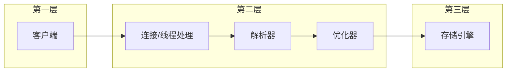

# MySQL 原理

## MySQL 逻辑架构

MySQL 采用 CS 架构，及客户端与服务器架构。

第一层客户端连接大多数基于 CS 结构都有类似的服务。MySQL 大多数核心功能都在这层，包含**查询解析**，**分析**，**优化**以及所有**内置函数**（日期，时间，加密函数），**存储过程**，**触发器**，**视图**。第三层是存储引擎

### 并发控制-锁

#### 读写锁

MySQL 读写锁分为**共享锁**（_读锁_）和**排它锁**（_写锁_）两种。读锁顾名思义，在资源的读取上时共享的，多个客户端同时对同一个资源进行读取，互不干扰，也互不阻塞。写锁（排它锁），当持有一个数据资源的写锁时既会阻塞读锁又阻塞其他客户端的读取。这样在同时操作数据的时候就保护了资源防止被覆盖的问题从而保障了数据的安全。

想象下，在一个 100 人的公司内，有个填写报名下周一团建的**腾讯在线文档**，每人去填写自己的名字，但是同时打开页面的时候发现别的都没有写于是开始写上自己的名字，猜猜看如果没有锁最后的结果会是怎么样？最后提交的数据就只有一条，名字就是最后提交的人。
