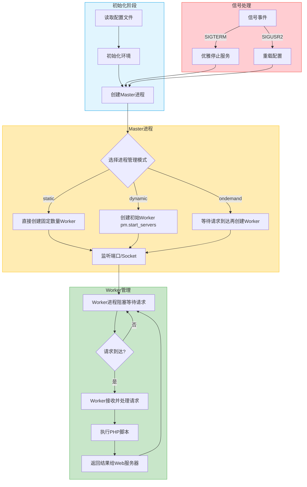

# PHP-FPM 启动流程

```mermaid
graph TB
    subgraph 初始化阶段[初始化阶段]
        A[读取配置文件] --> B[初始化环境]
        B --> C[创建Master进程]
    end

    subgraph Master进程[Master进程]
        C --> D{选择进程管理模式}
        D -->|static| E[直接创建固定数量Worker]
        D -->|dynamic| F[创建初始Worker pm.start_servers]
        D -->|ondemand| G[等待请求到达再创建Worker]
        E--> H[监听端口/Socket]
        F--> H
        G--> H
    end

    subgraph Worker管理[Worker管理]
        H --> I[Worker进程阻塞等待请求]
        I --> J{请求到达?}
        J -->|是| K[Worker接收并处理请求]
        J -->|否| I
        K --> L[执行PHP脚本]
        L --> M[返回结果给Web服务器]
        M --> I
    end

    subgraph 信号处理[信号处理]
        N[信号事件] -->|SIGTERM| O[优雅停止服务]
        N -->|SIGUSR2| P[重载配置]
        O --> C
        P --> C
    end
    style 初始化阶段 fill:#e1f5fe,stroke:#039be5
    style Master进程 fill:#ffecb3,stroke:#ffc107
    style Worker管理 fill:#c8e6c9,stroke:#4caf50
    style 信号处理 fill:#ffcdd2,stroke:#f44336
```
