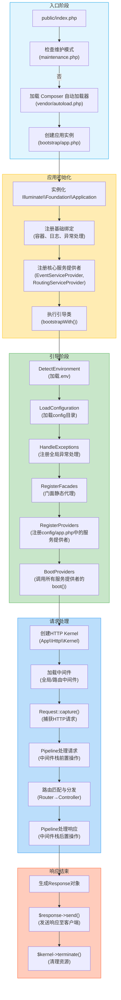

# laravel 启动原理

```mermaid
graph TB
    subgraph 入口阶段
        A["public/index.php"] --> B["检查维护模式<br>(maintenance.php)"]
        B -->|否| C["加载 Composer 自动加载器<br>(vendor/autoload.php)"]
        C --> D["创建应用实例<br>(bootstrap/app.php)"]
    end

    subgraph 应用初始化
        D --> E["实例化 Illuminate\\Foundation\\Application"]
        E --> F["注册基础绑定<br>(容器、日志、异常处理)"]
        F --> G["注册核心服务提供者<br>(EventServiceProvider, <br>RoutingServiceProvider)"]
        G --> H["执行引导类<br>(bootstrapWith())"]
    end

    subgraph 引导阶段
        H --> I["DetectEnvironment<br>(加载.env)"]
        I --> J["LoadConfiguration<br>(加载config目录)"]
        J --> K["HandleExceptions<br>(注册全局异常处理)"]
        K --> L["RegisterFacades<br>(门面静态代理)"]
        L --> M["RegisterProviders<br>(注册config/app.php中的服务提供者)"]
        M --> N["BootProviders<br>(调用所有服务提供者的boot())"]
    end

    subgraph 请求处理
        N --> O["创建HTTP Kernel<br>(App\\Http\\Kernel)"]
        O --> P["加载中间件<br>(全局/路由中间件)"]
        P --> Q["Request::capture()<br>(捕获HTTP请求)"]
        Q --> R["Pipeline处理请求<br>(中间件栈前置操作)"]
        R --> S["路由匹配与分发<br>(Router→Controller)"]
        S --> T["Pipeline处理响应<br>(中间件栈后置操作)"]
    end

    subgraph 响应结束
        T --> U["生成Response对象"]
        U --> V["$response->send()<br>(发送响应至客户端)"]
        V --> W["$kernel->terminate()<br>(清理资源)"]
    end

    style 入口阶段 fill:#e1f5fe,stroke:#039be5
    style 应用初始化 fill:#ffecb3,stroke:#ffc107
    style 引导阶段 fill:#c8e6c9,stroke:#4caf50
    style 请求处理 fill:#bbdefb,stroke:#2196f3
    style 响应结束 fill:#ffccbc,stroke:#ff5722
```
