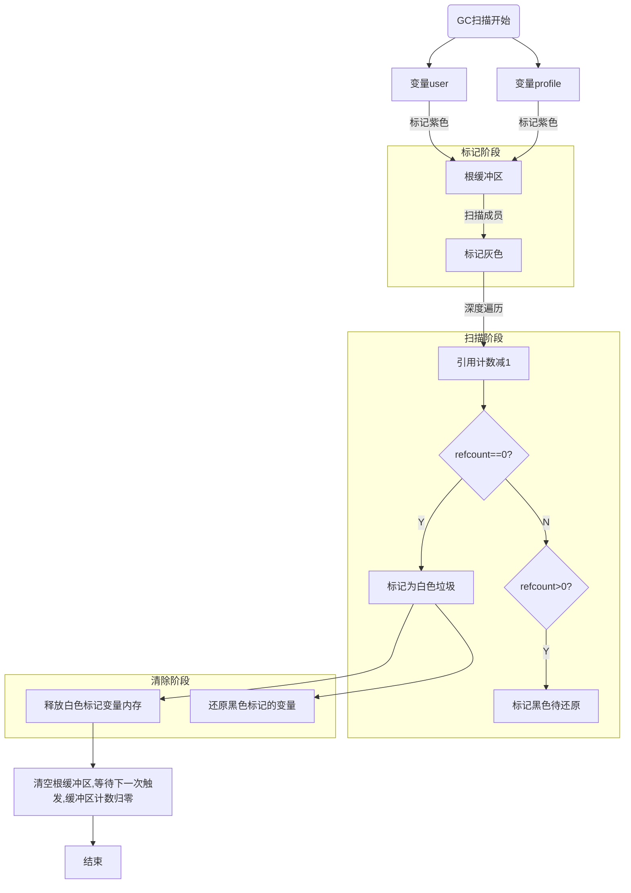

# PHP 垃圾回收 原理

> PHP 垃圾回收依赖两大部分，分别是垃圾回收器和垃圾回收算法。

## 垃圾回收器

垃圾回收器是 PHP 运行时环境提供的一种机制，用于回收不再使用的对象。

### 配置项：

#### zend.enable_gc 是否开启 GC

#### gc_probability gc 运行概率 1 为 100%

#### gc_divisor gc 概率分母

#### gc_maxlifetime 指定过了多少秒之后数据就会被视为“垃圾”并被清除

## 垃圾回收算法

PHP 垃圾回收算法是 PHP 运行时环境提供的一种算法，用于回收不再使用的对象。其中垃圾回收算法有几大概念：引用计数，循环引用检测，分代垃圾回收，标记清除法。

### 触发

1. unset

主动 unset 变量

2. 函数返回

函数运行结束后，return，作用域内的变量会触发 gc

3. 脚本结束

脚本自然运行结束，会触发 gc，释放所有变量内存

4. 根缓冲区满

根缓冲区大小默认为 10,000 条记录，满了后就会触发 gc 主动释放内存

### 引用计数

php 每个变量在 zend 中都有维护一个引用计数，当变量被引用时，引用计数加 1，当变量不再被引用时，引用计数减 1，当引用计数为 0 时，变量被销毁。

### 循环引用检测

php 通过三色标记法【黑、灰、白】结合深度优先遍历，来识别循环引用。

### 分代垃圾回收

把变量按存活时间分成三代，年轻代：新创建的变量 gc 扫码频率最高。中生代，存活一段时间的变量扫描频率降低。 长期存活的变量，扫码频率最低。
减少垃圾回收的频率，可以提高性能。

### 标记清除法

通过标记变量为白色，最后白色垃圾统一释放，提高性能。而非每个变量都进行释放，频繁向系统申请内存，也会提高性能。

## php 垃圾回收流程

> 代码：

```php
<?php
class User {
    public $profile;
}
class Profile {
    public $user;
}

// 创建循环引用
$user = new User();
$profile = new Profile();
$user->profile = $profile;  // User引用Profile
$profile->user = $user;     // Profile引用User

// 断开外部引用
unset($user, $profile);
```

### 垃圾回收流程



### 引用计数变化

```php
<?php
$a = new stdClass(); // 新建变量 refcount=1,is_ref=0
$b = new stdClass(); // 新建变量 refcount=1,is_ref=0
$a->ref = $b;  // 变量赋值 $b refcount=2,is_ref=1,
$b->ref = $a;  // 变量赋值 $a refcount=2,is_ref=1,
unset($a, $b); // 循环引用，refcount=1

gc_collect_cycles(); // 手动触发GC
print_r(gc_status());
// 输出: ["collected" => 2] // 回收2个对象
```
