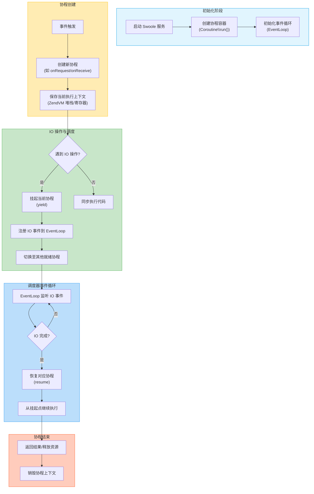

# php-swoole 协程原理

```mermaid
graph TB
    subgraph 初始化阶段[初始化阶段]
        A[启动 Swoole 服务] --> B["创建协程容器<br>(Coroutine\\run())"]
        B --> C["初始化事件循环<br>(EventLoop)"]
    end

    subgraph 协程创建阶段[协程创建]
        D[事件触发] --> E["创建新协程<br>(如 onRequest/onReceive)"]
        E --> F["保存当前执行上下文<br>(ZendVM 堆栈/寄存器)"]
    end

    subgraph IO处理阶段[IO 操作与调度]
        F --> G{遇到 IO 操作?}
        G -->|是| H["挂起当前协程<br>(yield)"]
        H --> I[注册 IO 事件到 EventLoop]
        I --> J[切换至其他就绪协程]
        G -->|否| K[同步执行代码]
    end

    subgraph 调度器工作[调度器事件循环]
        J --> L[EventLoop 监听 IO 事件]
        L --> M{IO 完成?}
        M -->|是| N["恢复对应协程<br>(resume)"]
        N --> O[从挂起点继续执行]
        M -->|否| L
    end

    subgraph 结果处理[协程结束]
        O --> P[返回结果/释放资源]
        P --> Q[销毁协程上下文]
    end

    style 初始化阶段 fill:#e1f5fe,stroke:#039be5
    style 协程创建阶段 fill:#ffecb3,stroke:#ffc107
    style IO处理阶段 fill:#c8e6c9,stroke:#4caf50
    style 调度器工作 fill:#bbdefb,stroke:#2196f3
    style 结果处理 fill:#ffccbc,stroke:#ff5722
```
