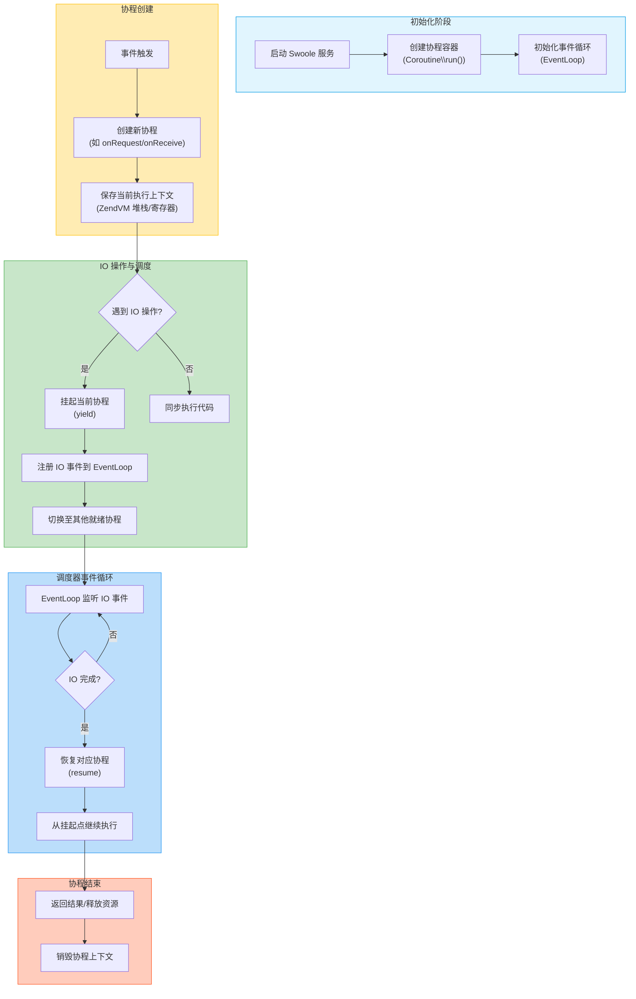
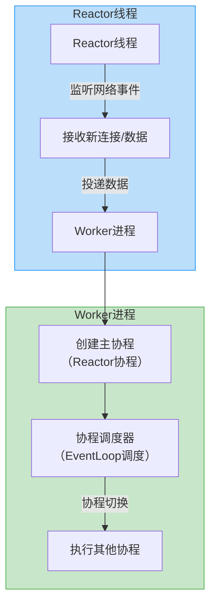

# php-swoole 协程原理

## 协程切换调度原理

## select poll epoll

### select

select 是一个系统调用，用于等待多个文件描述符的可读或可写事件。select 函数会阻塞当前进程，直到有文件描述符满足条件。长度默认为 1024, **无差别轮询**

1. 用户初始化 fd_set（设置需监听的 FD 位为 1）
2. 调用 select 将 FD 集合复制到内核
3. 内核遍历所有 FD，检查是否就绪（如读缓冲区有数据）
4. 就绪的 FD 对应位保留为 1，未就绪置 0
5. 内核将修改后的集合复制回用户态
6. 用户遍历整个集合找出就绪的 FD

### poll

poll 函数和 select 函数类似，但 poll 函数有如下区别：与 select 没什么区别，唯一区别就是长度限制没有了，唯一就是受到 linux fd 的约束 **无差别轮询**

1. 使用 pollfd 结构体数组管理 FD，无数量限制，但仍需每次复制整个数组到内核，内核轮询所有 FD。
2. 用户初始化 pollfd 数组（指定 FD 及关注的事件 events）
3. 调用 poll 将数组复制到内核
4. 内核遍历数组检查每个 FD 的状态
5. 将就绪事件写入 revents 字段
6. 内核返回就绪的 FD 数量
7. 用户遍历数组检查 revents 处理事件

### epoll

通过事件回调触发，swoole 就用这个 epoll

1. 基于事件驱动：通过 epoll_ctl 注册 FD 到内核的红黑树，事件发生时通过回调将就绪 FD 加入就绪链表，epoll_wait 仅返回就绪的 FD。 |
2. epoll_create 创建 epoll 实例（内核维护红黑树和就绪链表）
3. epoll_ctl 注册 FD（添加到红黑树，并注册回调函数）
4. FD 就绪时，内核回调函数将其加入就绪链表
5. epoll_wait 从就绪链表中获取事件（无需遍历所有 FD）
6. 用户直接处理返回的就绪事件
