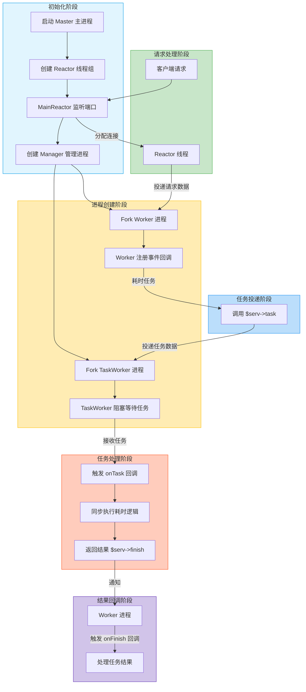

# swoole 原理

```mermaid
graph TB
    subgraph 初始化阶段
        A[启动 Master 主进程] --> B[创建 Reactor 线程组]
        B --> C[MainReactor 监听端口]
        C --> D[创建 Manager 管理进程]
    end

    subgraph 进程创建阶段
        D --> E[Fork Worker 进程]
        D --> F[Fork TaskWorker 进程]
        E --> G[Worker 注册事件回调]
        F --> H[TaskWorker 阻塞等待任务]
    end

    subgraph 请求处理阶段
        I[客户端请求] --> C
        C --分配连接--> J[Reactor 线程]
        J --投递请求数据--> E
    end

    subgraph 任务投递阶段
        G --耗时任务--> K[调用 $serv->task]
        K --投递任务数据--> F
    end

    subgraph 任务处理阶段
        H --接收任务--> L[触发 onTask 回调]
        L --> M[同步执行耗时逻辑]
        M --> N[返回结果 $serv->finish]
    end

    subgraph 结果回调阶段
        N --通知--> O[Worker 进程]
        O --触发 onFinish 回调--> P[处理任务结果]
    end

    style 初始化阶段 fill:#e1f5fe,stroke:#039be5
    style 进程创建阶段 fill:#ffecb3,stroke:#ffc107
    style 请求处理阶段 fill:#c8e6c9,stroke:#4caf50
    style 任务投递阶段 fill:#bbdefb,stroke:#2196f3
    style 任务处理阶段 fill:#ffccbc,stroke:#ff5722
    style 结果回调阶段 fill:#d1c4e9,stroke:#673ab7
```
