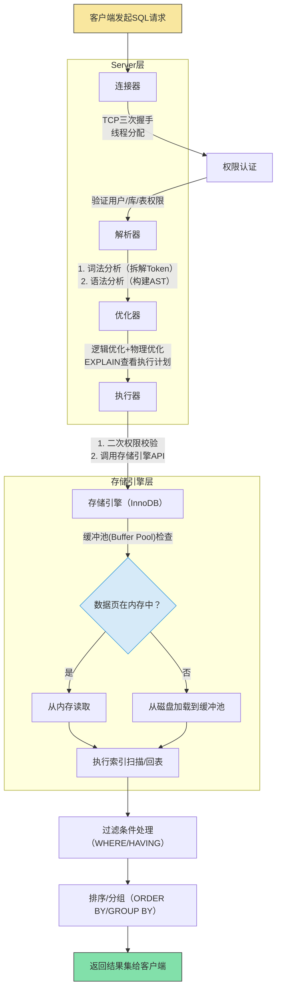

# 数据库原理

## 执行过程

1. 客户端发起 SQL 请求
2. 权限校验
3. 解析 SQL
4. 构建 AST 抽象语法树
5. 查询优化器
6. 提交给执行器
7. 执行器选用不同的存储引擎执行



## 索引原理

### 索引底层使用什么数据结构算法？

索引底层使用 B+树，叶子节点存储完整的数据行，一般 B+树的层高为 3 ～ 4 层，每层数据就是一次 io，而三次 io 就是就是磁盘访问的效率拐点，每次大概在 10ms 内响应，三次即 30ms。更大则需要分表，数据量大概在 5000 万的时候就是四层了。

### 为什么 MySQL InnoDB 选择 B+tree 作为索引的数据结构？

索引底层使用 B+树，叶子节点存储完整数据行，B+树是平衡二叉树，B+树在插入数据时，会尽量保持平衡，因此插入数据时，会尽量避免数据移动，从而提高插入效率。同时叶子节点使用双向链表串起来，适配范围查询，顺序扫描对于磁盘友好，因为磁盘的磁头移动是顺序的。

## 锁

锁分为悲观锁和乐观锁，悲观锁是先上锁，然后执行，然后释放锁，乐观锁是先执行，然后判断是否冲突，如果冲突则重试，直到成功。

> mysql 的锁是基于索引生效的，如果锁定的数据没有索引，则锁全表。锁升级条件为，当非唯一索引重复值超过表记录的 50%时，行锁升级为表锁。

### 共享锁

```sql
-- 显式加共享锁（S）
SELECT * FROM users WHERE id = 1 LOCK IN SHARE MODE;
```

### 排他锁

```sql
-- 显式加排他锁（X）
SELECT * FROM users WHERE id = 1 FOR UPDATE;
-- 隐式加锁：INSERT/UPDATE/DELETE 自动加X锁[6](@ref)
```

### 间隙锁（Gap Lock）

传统的行锁只能锁定表中已经存在的行，因此就算你把表中所有行都锁住，也无法阻止插入新行（幻读问题）。为了解决这个问题 InnoDB 引入 gap lock（间隙锁）。
间隙锁是为了解决可重复读的时候防止幻读的机制。

比如：

```sql
CREATE TABLE employees (
    id INT AUTO_INCREMENT PRIMARY KEY,
    name VARCHAR(50) NOT NULL,
    age INT NOT NULL,
    INDEX idx_age (age)  -- 普通索引
) ENGINE=InnoDB;
```

已有数据：
|id|name|age|
|-|-|-|
|1|Alicd|25|
|2|Bob|30|
|3|Charlie|35|

开启事务：

```sql
-- 事务 A
START TRANSACTION;
SELECT * FROM employees
WHERE age BETWEEN 25 AND 35 FOR UPDATE;  -- 锁定 age 在 25~35 的范围
```

**加锁效果:**
**记录锁**: 锁定 age=25, 30, 35 的现有行（防止修改或删除）。
**间隙锁**: 锁定区间 (25, 35)，阻止插入 age=26, 27, ..., 34 的新记录。

```sql
-- 事务 B
START TRANSACTION;
INSERT INTO employees (name, age) VALUES ('David', 28);  -- age=28 位于 (25,35) 区间
```

**结果 ​:**
插入操作被阻塞 ​！因为 age=28 在事务 A 的间隙锁范围内。
事务 B 需等待事务 A 提交或回滚才能继续。

### Next-Key Lock

案例：

```sql
CREATE TABLE employees (
    id INT AUTO_INCREMENT PRIMARY KEY,   -- 主键索引
    age INT NOT NULL,
    INDEX idx_age (age)                  -- 普通索引（非唯一）
) ENGINE=InnoDB;

-- 初始数据
INSERT INTO employees (id, age) VALUES
(1, 25), (5, 30), (10, 35), (15, 40);
```

已有数据：
|id|age|
|-|-|
|1|25|
|5|30|
|10|35|
|15|40|

索引 idx_age 的间隙分布 ​（按 age 排序）：

```sql
(-∞, 25], (25, 30], (30, 35], (35, 40], (40, +∞)
```

步骤 1：事务 A 执行范围查询并加锁 ​

```sql
-- 事务 A
BEGIN;
SELECT * FROM employees
WHERE age BETWEEN 30 AND 40 FOR UPDATE;  -- 锁定 age 在 30~40 的范围
```

加锁逻辑 ​ ：

1. ​ 定位起始点 ​：找到 age=30（id=5），加 Next-Key Lock (25, 30]（左开右闭）。
2. ​ 范围扫描 ​：向右遍历至 age=35（id=10），加 Next-Key Lock (30, 35]；继续到 age=40（id=15），加 Next-Key Lock (35, 40]。
3. ​ 最终锁范围 ​：
   ​Next-Key Locks​：(25, 30] + (30, 35] + (35, 40]
   ​ 实际等效区间 ​：(25, 40]（覆盖所有 age 在 30~40 的记录及间隙）。

事务 B 尝试并发操作 ​

```sql
-- 事务 B（独立事务）
INSERT INTO employees (age) VALUES (28);  -- 插入 age=28（位于间隙 (25,30)）
INSERT INTO employees (age) VALUES (33);  -- 插入 age=33（位于间隙 (30,35)）
UPDATE employees SET age = 32 WHERE id = 5; -- 修改 id=5 的 age（原 age=30）
```

#### 间隙锁和 Next-Key Lock 区别

比如有以下索引值：age [25, 30, 35]

我有 sql:

```sql
SELECT * FROM employees WHERE age BETWEEN 25 AND 35 FOR UPDATE;
```

间隙锁：锁定的是 26,27,28,29 和 31,32,33,34
而 Next-Key Lock：(26,27,28,29,30),(31,32,33,34,35) （左开右闭） 两个区间

间隙锁只锁定范围内的数据，而 Next-Key Lock 锁定范围数据四间隙锁加右边临界值

## 事务

事务是指一系列的数据库操作要么全都成功，要么全都失败回滚。

### ACID 四大特性：

1. 原子性
   事务内的操作不可分割。比如多条插入语句，不会产生只有某一条成功的结果。
2. 一致性
   事务操作之后, 数据库所处的状态和业务规则是一致的; 比如 a,b 账户相互转账，不会因为 a 转完事务崩溃，b 未入账的情况。
3. 隔离性
   并发事务互不干扰，通过锁和 MVCC 实现
4. 持久性
   事务提交后数据永久存储

### MVVC（Multi-Version Concurrency Control） 多版本并发控制

#### 解决问题

1. 读写阻塞问题 ​
   我们在事务中，如果为了保证数据正确，我们一般会把数据加锁，但是这样也会导致写阻塞，比如一个事务正在写数据，另一个事务正在读数据，那么就会产生阻塞。
   而 MVCC 就可以在不加锁的前提下解决这个问题。
   读操作直接访问事务开始时的数据快照（旧版本），写操作创建新版本数据。读写操作互不阻塞，显著提升吞吐量
2. 解决脏读
3. 降低锁开销

### 脏读

读取未提交的“脏数据”​​

只出现在【未提交读】

```sql
-- 事务A（修改数据未提交）
START TRANSACTION;
UPDATE accounts SET balance = balance - 100 WHERE id = 1;  -- 余额从1000→900（未提交）

-- 事务B（读取未提交数据）
START TRANSACTION;
SELECT balance FROM accounts WHERE id = 1;  -- 读到900（脏读）

-- 事务A回滚
ROLLBACK;  -- 余额恢复为1000，但事务B已使用错误值900
```

### 幻读

幻读：结果集“凭空增减”​​

```sql
-- 事务A（统计订单）
START TRANSACTION;
SELECT COUNT(*) FROM orders WHERE status = 'unpaid';  -- 返回10条

-- 事务B（新增订单）
START TRANSACTION;
INSERT INTO orders (user_id, status) VALUES (5, 'unpaid');  -- 插入1条未支付订单
COMMIT;

-- 事务A（再次统计）
SELECT COUNT(*) FROM orders WHERE status = 'unpaid';  -- 返回11条（幻读）
```

### 回表

回表是 MySQL（尤其是 InnoDB 引擎）中基于非聚簇索引（二级索引）查询时的一种特殊数据访问机制。当查询涉及的字段未完全包含在二级索引中时，数据库需要通过二级索引定位到主键值，再回到主键索引（聚簇索引）中获取完整数据行。这一过程称为回表，其本质是索引结构限制导致的额外 I/O 操作，可能成为性能瓶颈。

条件：

1. 查询字段超出索引范围 ​（若查询结果需返回的字段未包含在当前使用的二级索引中，则需回表补全数据。
   示例：索引仅覆盖(name, age)，但查询需要 email 字段。）
2. 使用非聚簇索引且需完整行数据 ​
3. 索引字段长度超限

例子：

```sql
CREATE TABLE users (
    id INT PRIMARY KEY,        -- 主键（聚簇索引）
    name VARCHAR(50),
    age INT,
    email VARCHAR(100),
    INDEX idx_age (age)        -- 二级索引（仅含age和id）
);
```

#### 案例 1：触发回表（需获取未索引字段）

```sql
SELECT * FROM users WHERE age = 25;
```

1.  通过二级索引 idx_age 查找 age=25 的记录，获取对应主键 id（如 id=101）；
2.  根据 id=101 回表扫描主键索引，获取完整行数据（name, email 等）。
    查询结果中，email 字段未包含在索引中，需回表补全。

#### 案例 2：避免回表（覆盖索引）

```sql
-- 创建覆盖索引
CREATE INDEX idx_age_name ON users(age, name);

-- 查询仅需索引字段
SELECT age, name FROM users WHERE age = 25;
```

#### 案例 3：主键查询无需回表

```sql
SELECT * FROM users WHERE id = 101;
```

### 索引下推

索引下推（Index Condition Pushdown，简称 ICP）是 MySQL 5.6 版本引入的一项查询优化技术，​ 核心目标是通过在存储引擎层提前过滤数据，减少回表次数和 Server 层负载。其本质是将 WHERE 条件中可索引过滤的部分“下推”到存储引擎层执行，而非在 Server 层处理无效数据。

案例：

```sql
CREATE TABLE employees (
    id INT PRIMARY KEY,
    name VARCHAR(50),
    age INT,
    salary DECIMAL(10,2),
    INDEX idx_name_age (name, age)  -- 联合索引
);
```

查询：

```sql
SELECT * FROM employees
WHERE name LIKE '张%' AND age = 30;
```

| 场景 ​  | 执行过程 ​                                                                                              | 回表次数 ​ |
| ------- | ------------------------------------------------------------------------------------------------------- | ---------- |
| 无 ICP​ | 1. 通过索引找所有 name LIKE '张%' 的主键（如 100 条）2. 回表 100 次 3. Server 层过滤 age=30（剩 10 条） | 100 次     |
| 有 ICP​ | 1. 存储引擎直接在索引中过滤 name LIKE '张%' AND age=30 2. 仅回表 10 次                                  | 10 次 ​    |
